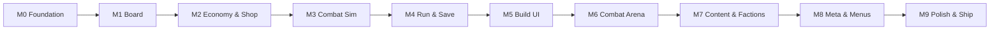

> **SUPERSEDED - DO NOT DESIGN FROM THIS FILE.**
> This document is archived history. Systems described here have been renamed,
> replaced or deleted (Morale as a run resource, Gold, 8x2 reserves, 6 shop slots, ...).
> **The authoritative design is [`docs/GDD.md`](../../../GDD.md).** See `docs/archive/README.md`.

---

# DeadManZone — Greenfield Implementation Plan

> **For agentic workers:** REQUIRED SUB-SKILL: Use superpowers:subagent-driven-development (recommended) or superpowers:executing-plans to implement this plan milestone-by-milestone. Steps use checkbox (`- [ ]`) syntax for tracking.

**Goal:** Build DeadManZone from an empty Unity 6 project to a shippable 10-fight demo: spatial loadout autobattler with four-resource economy, deterministic tick combat, 3D Synty arena presentation, and data-driven content pipeline.

**Architecture:** Pure C# `DeadManZone.Core` (no Unity engine refs) owns board, shop, combat sim, synergies, and save schema. Thin `DeadManZone.Game` orchestrates run flow. `DeadManZone.Presentation` handles 2D build UI and 3D combat arena replay. All content lives in ScriptableObjects under `DeadManZone.Data`.

**Tech Stack:** Unity 6, URP, C# 10+, Unity Test Framework (EditMode + PlayMode), Newtonsoft.Json (`com.unity.nuget.newtonsoft-json`), TextMeshPro, uGUI, Synty POLYGON asset packs, Input System (Both legacy + new).

**Design reference:** `docs/DeadManZone-Game-Design-Document.md` (v2.0)

---

## How to use this plan

This document assumes **zero existing code**. If rebuilding in the current repo, map milestones to gaps rather than rewriting shipped systems. Each milestone ends with **working, testable software** and explicit acceptance criteria.

**Estimated calendar (solo dev, focused):** 12–16 weeks  
**Estimated calendar (agent-assisted, parallel art):** 8–10 weeks

---

## Milestone overview



| Milestone | Name | Primary deliverable | Depends on |
|-----------|------|---------------------|------------|
| **M0** | Project foundation | Assemblies, RNG, grid primitives, CI test runner | — |
| **M1** | Board & placement | Zoned grid, shapes, Reserves, rotation | M0 |
| **M2** | Economy & shop | Four resources, 3-lane shop, salvage | M1 |
| **M3** | Combat sim | Tick combat, segments, tactics, abilities, event log | M1 |
| **M4** | Run orchestration | 10-fight gauntlet, save/resume, battle report | M2, M3 |
| **M5** | Build presentation | Drag-drop board, shop UI, HUD, sell zone | M4 |
| **M6** | Combat arena | 3D Synty arena, replay, pause freeze, VFX | M3, M5 |
| **M7** | Content pipeline | 25 pieces, 3 playable + 3 enemy factions, tag registry | M2, M3, M6 |
| **M8** | Meta & menus | Main menu, achievements, leaderboard, faction unlocks | M4 |
| **M9** | Polish & ship | Balance pass, art pass, playtest criteria, Steam stub | M5–M8 |

---

## Target file map (final state)

```
Assets/_Project/
  Core/
    Common/           Rng, GridCoord, Tags
    Board/            ZoneType, PieceShape, BoardState, ReservesState, BattlefieldState
    Shop/             ShopGenerator, ShopOffer, ShopSlotLayoutResolver
    Combat/           TickCombatRun, CombatMovement, CombatDamageResolver,
                      TacticEffects, CombatAbilityExecutor, GasDamageSystem, CombatEvent
    Synergies/        SynergyEngine, CriticalMassRules
    Run/              RunState, RunPhase, RunSaveSerializer, BattleReportBuilder
    Economy/          SalvageCalculator, ManpowerGate, MoraleCalculator
    Meta/             MetaProgressionService, AchievementCatalog
    Content/          ContentRegistry (runtime id lookup)
  Core.Tests/EditMode/
  Data/
    ScriptableObjects/  PieceDefinitionSO, FactionSO, EnemyTemplateSO, configs
    ContentDatabase.cs
    Editor/             DemoContentGenerator, SyntyArtBatchRunner, scene setup menus
  Game/
    RunOrchestrator.cs, RunManager.cs, SaveManager.cs
  Presentation/
    Board/              BoardView, drag-drop, hover cards
    Shop/               ShopView, ShopOfferView, buff strip
    Combat/Arena/       CombatArenaPresenter, CombatUnitActor, CombatGridMapper, VFX
    Run/                RunSceneController, BuildScreenHudController
    Menu/               MainMenuController, faction select
  Presentation.Editor/  URP setup, Synty art pass, scene builders
  Tests.PlayMode/
  Art/Synty/            Arena prefabs, icons, wrappers
  Scenes/               MainMenu.unity, Run.unity, CombatArena.unity (additive)
docs/
  DeadManZone-Game-Design-Document.md
  demo-guide.md
```

---

## Data-driven design (cross-cutting)

Implement these **before M7 content authoring at scale**:

### ScriptableObject types (create in M0–M2, populate in M7)

| Asset | Path pattern | Purpose |
|-------|--------------|---------|
| `TagRegistrySO` | `Data/Tags/TagRegistry.asset` | Canonical tag vocabulary |
| `PieceDefinitionSO` | `Data/Pieces/{id}.asset` | All piece data |
| `FactionSO` | `Data/Factions/{id}.asset` | HQ, starting resources, rules |
| `EnemyTemplateSO` | `Data/Enemies/fight_{n}.asset` | Pre-built enemy boards |
| `SynergyRuleSO` | `Data/Rules/Synergies/` | Adjacency bonuses |
| `CriticalMassRuleSO` | `Data/Rules/CriticalMass/` | Threshold bonuses |
| `CombatPacingConfigSO` | `Data/Config/CombatPacing.asset` | Segment ticks |
| `CombatArenaConfigSO` | `Data/Config/CombatArena.asset` | Arena layout |
| `VisualProfileSO` | `Data/Config/VisualProfile.asset` | Theme + arena refs |
| `UiThemeSO` | `Data/UI/SyntyTrenchUiTheme.asset` | Sprites, fonts, colors |
| `ContentDatabase` | `Data/ContentDatabase.asset` | Master index |

### Bootstrap pattern

```csharp
// ContentDatabase builds immutable ContentRegistry at load:
public ContentRegistry BuildRegistry()
{
    var registry = new ContentRegistry();
    foreach (var piece in pieces) registry.Register(piece.ToDefinition());
    // factions, enemies, rules...
    return registry;
}
```

### Editor validation (implement in M7 Task 1)

- `[ValidatePieceDefinition]` — tag counts, HQ rules, required prefabs for combatants.
- `DeadManZone → Validate All Content` menu — fails CI if any piece invalid.

---

# M0 — Project foundation

**Goal:** Empty Unity 6 URP project with assembly boundaries, deterministic RNG, and first passing EditMode test.

**Acceptance criteria:**
- [ ] Five assemblies compile with correct dependency chain (Core has no Unity refs)
- [ ] EditMode test runner passes from CLI
- [ ] URP assigned as active pipeline

### Task M0-1: Create project structure

**Files:**
- Create: `Assets/_Project/Core/DeadManZone.Core.asmdef`
- Create: `Assets/_Project/Core.Tests/DeadManZone.Core.Tests.asmdef`
- Create: `Assets/_Project/Data/DeadManZone.Data.asmdef`
- Create: `Assets/_Project/Game/DeadManZone.Game.asmdef`
- Create: `Assets/_Project/Presentation/DeadManZone.Presentation.asmdef`

- [ ] **Step 1:** Create Unity 6 project with URP template.
- [ ] **Step 2:** Add assembly definitions per GDD §16. Core asmdef must NOT reference `UnityEngine`.
- [ ] **Step 3:** Add Newtonsoft.Json via Package Manager.
- [ ] **Step 4:** Create `DeadManZone → Rendering → Setup URP For Project` editor script stub.

### Task M0-2: Deterministic RNG

**Files:**
- Create: `Assets/_Project/Core/Common/Rng.cs`
- Create: `Assets/_Project/Core/Common/GridCoord.cs`
- Test: `Assets/_Project/Core.Tests/EditMode/RngTests.cs`

- [ ] **Step 1: Write failing test**

```csharp
[Test]
public void SameSeed_ProducesSameSequence()
{
    var a = new Rng(12345);
    var b = new Rng(12345);
    for (int i = 0; i < 100; i++)
        Assert.AreEqual(a.NextInt(1000), b.NextInt(1000));
}
```

- [ ] **Step 2:** Run EditMode tests — expect FAIL.
- [ ] **Step 3:** Implement seeded `Rng` (xorshift or SplitMix64).
- [ ] **Step 4:** Tests PASS.

### Task M0-3: Tag constants scaffold

**Files:**
- Create: `Assets/_Project/Core/Common/TagIds.cs` (string constants)
- Create: `Assets/_Project/Data/ScriptableObjects/TagRegistrySO.cs`

- [ ] Define primary, role, system, faction, synergy tag ID constants matching GDD §8.
- [ ] `TagRegistrySO` holds display names + categories for editor picker (implementation M7).

---

# M1 — Board & placement

**Goal:** Player can place shaped pieces on a 9×10 zoned grid and in a 2×9 Reserves grid with rotation validation.

**Acceptance criteria:**
- [ ] Placement respects zone rules (rear/support/front)
- [ ] Shaped pieces (L, 2×2) fit without overlap
- [ ] Q/R rotation cycles 0/90/180/270
- [ ] Reserves accepts any shape that fits
- [ ] ≥15 EditMode tests for placement edge cases

### Task M1-1: Board data structures

**Files:**
- Create: `Core/Board/ZoneType.cs`, `PieceShape.cs`, `PieceDefinition.cs`, `PlacedPiece.cs`
- Create: `Core/Board/BoardLayout.cs`, `BoardState.cs`, `ReservesState.cs`
- Test: `Core.Tests/EditMode/BoardStateTests.cs`

Key types:

```csharp
public readonly struct PieceDefinition
{
    public string PieceId { get; init; }
    public IReadOnlyList<GridCoord> ShapeCells { get; init; }
    public ZoneMask AllowedZones { get; init; }
    public IReadOnlyList<string> Tags { get; init; }
    // economy + combat fields added in M2/M3
}

public sealed class BoardState
{
    public bool TryPlace(PlacedPiece piece, out string error);
    public bool TryMove(string instanceId, GridCoord newAnchor, int rotation);
    public IEnumerable<PlacedPiece> GetAdjacent(string instanceId);
}
```

- [ ] Implement zone masks for 9×10 layout (rear cols 0–3, support 4–6, front 7–8).
- [ ] Tests: valid front placement, invalid rear-only unit in front, overlap rejection, rotation changes footprint.

### Task M1-2: Battlefield layout (25-wide)

**Files:**
- Create: `Core/Board/BattlefieldState.cs`, `BattlefieldLayout.cs`
- Test: `Core.Tests/EditMode/BattlefieldStateTests.cs`

- [ ] Map player half (cols 0–8), neutral (9–15), enemy (16–24).
- [ ] `IsNeutralColumn(int x)` for movement cost hooks (M3).

---

# M2 — Economy & shop

**Goal:** Four-resource economy with 3-lane shop generation, buy/reroll/freeze, salvage, manpower gate.

**Acceptance criteria:**
- [ ] Cannot start fight when manpower upkeep exceeds pool
- [ ] Shop offers respect lane + fight-index weighting
- [ ] Freeze preserves slot index on reroll
- [ ] Salvage returns 50/50/25% refunds

### Task M2-1: Resource model

**Files:**
- Create: `Core/Economy/ResourceBundle.cs`, `ManpowerGate.cs`, `SalvageCalculator.cs`
- Create: `Core/Run/RunEconomyState.cs`
- Test: `Core.Tests/EditMode/SalvageCalculatorTests.cs`, `ManpowerGateTests.cs`

```csharp
public readonly struct ResourceBundle
{
    public int Supplies { get; init; }
    public int Manpower { get; init; }
    public int Authority { get; init; }
    public int Morale { get; init; }
}
```

- [ ] Manpower gate sums `manpowerCost` of all deployed combatants.
- [ ] Salvage tests include Dust Scourge +25% supplies bonus flag.

### Task M2-2: Shop generator

**Files:**
- Create: `Core/Shop/ShopLane.cs`, `ShopOffer.cs`, `ShopState.cs`, `ShopGenerator.cs`
- Create: `Core/Shop/ShopSlotDefinition.cs`, `ShopSlotLayoutResolver.cs`
- Test: `Core.Tests/EditMode/ShopGeneratorTests.cs`

- [ ] Three lanes, 3 base offers each.
- [ ] Fight-index weighting table from GDD §10.
- [ ] Board modifier hooks (Supply Depot −10% prices).
- [ ] Seeded generation: same seed + fight index → same offers.

---

# M3 — Combat sim

**Goal:** Deterministic tick combat with four segments, two pause windows, tactics, three demo abilities, event log.

**Acceptance criteria:**
- [ ] Same seed + boards + commands → byte-identical event log
- [ ] Win/loss/HQ destruction/draw paths tested
- [ ] Gas ramp triggers in segment 3b
- [ ] Neutral column 2× movement cost verified

### Task M3-1: Combatant runtime state

**Files:**
- Create: `Core/Combat/CombatantState.cs`, `CombatEvent.cs`, `CombatSegment.cs`
- Create: `Core/Combat/CombatPacingConfig.cs` (data-only struct; SO wrapper in Data layer)
- Test: `Core.Tests/EditMode/CombatantStateTests.cs`

### Task M3-2: Movement & targeting

**Files:**
- Create: `Core/Combat/CombatMovement.cs`, `CombatTargeting.cs`, `CombatRoleProfile.cs`
- Test: `Core.Tests/EditMode/CombatMovementTests.cs`

- [ ] Movement charge budget per tier.
- [ ] Manhattan range check.
- [ ] Tactic modifies target preference (Disciplined Fire → weakest HP).

### Task M3-3: Damage resolver

**Files:**
- Create: `Core/Combat/CombatDamageResolver.cs`
- Test: `Core.Tests/EditMode/CombatDamageResolverTests.cs`

- [ ] Armor DR + RPS multipliers from GDD §6.
- [ ] Tests for each attack type vs each armor type.

### Task M3-4: Tick combat run

**Files:**
- Create: `Core/Combat/TickCombatRun.cs`, `GasDamageSystem.cs`
- Create: `Core/Combat/TacticEffects.cs`, `CombatAbilityExecutor.cs`
- Create: `Core/Combat/PhaseCommand.cs`, `PauseSubmission.cs`
- Test: `Core.Tests/EditMode/TickCombatRunTests.cs`, `DeterminismTests.cs`

```csharp
public sealed class TickCombatRun
{
    public CombatResult Run(
        int seed,
        BattlefieldState player,
        BattlefieldState enemy,
        IReadOnlyList<PauseSubmission> pauses,
        CombatPacingConfig pacing,
        ContentRegistry content);
}
```

- [ ] Segment loop: Opening (50 ticks) → pause → Main Fight (300) → pause → Brief Push (50) → Gas until winner.
- [ ] **Determinism test:** run twice, assert event logs equal.

### Task M3-5: Synergies

**Files:**
- Create: `Core/Synergies/SynergyEngine.cs`, `CriticalMassRules.cs`
- Test: `Core.Tests/EditMode/SynergyEngineTests.cs`, `CriticalMassRulesTests.cs`

- [ ] Fight-start buff application.
- [ ] Adjacency detection uses board snapshot at combat start.

---

# M4 — Run orchestration & save

**Goal:** Full 10-fight gauntlet loop with auto-save, mid-combat resume, battle report.

**Acceptance criteria:**
- [ ] Headless sim completes 10 fights without Unity
- [ ] Save mid-pause → load → identical combat outcome
- [ ] Authority resets each build round
- [ ] Morale loss on defeat scales with fight index

### Task M4-1: Run state machine

**Files:**
- Create: `Core/Run/RunPhase.cs`, `RunState.cs`, `GauntletConfig.cs`
- Create: `Game/RunOrchestrator.cs` (partial classes: Shop, Combat, Save)
- Test: `Core.Tests/EditMode/RunOrchestratorTests.cs`

States: `Build → Combat → Aftermath → (Build | Victory | Defeat)`

- [ ] HQ auto-spawn from `FactionSO` on `StartNewRun`.
- [ ] Fight index 1–10 with enemy template lookup.

### Task M4-2: Save serializer

**Files:**
- Create: `Core/Run/RunSaveSerializer.cs`, `RunSaveDto.cs`
- Create: `Game/SaveManager.cs`
- Test: `Core.Tests/EditMode/RunSaveSerializerTests.cs`

- [ ] JSON schema includes mid-combat: seed, tick, segment, partial event log, pending pause.
- [ ] Round-trip test: save → mutate unrelated field → load → state equal.

### Task M4-3: Battle report

**Files:**
- Create: `Core/Run/BattleReportBuilder.cs`, `BattleReport.cs`
- Test: `Core.Tests/EditMode/BattleReportBuilderTests.cs`

- [ ] Top 3 damage dealt/taken, supplies reward, morale delta, manpower refund.

---

# M5 — Build presentation (2D UI)

**Goal:** Playable build phase — drag-drop board, shop lanes, HUD, sell zone, rotation, manpower gate UI.

**Acceptance criteria:**
- [ ] Player can complete buy → place → begin fight flow entirely in UI
- [ ] Manpower gate disables Begin Fight with clear message
- [ ] Emergency Draft button works once per run
- [ ] Shop freeze/reroll visually correct

### Task M5-1: Board view

**Files:**
- Create: `Presentation/Board/BoardView.cs`, `BoardCellView.cs`, `PieceDragController.cs`
- Create: `Presentation/Board/PieceShapeVisual.cs`, `PieceHoverCard.cs`
- Scene: `Scenes/Run.unity`

- [ ] Grid renders 9×10 with zone color strips.
- [ ] Drag from shop/reserves/board; snap to valid cells; red highlight invalid.
- [ ] Q/R rotation while dragging.

### Task M5-2: Shop view

**Files:**
- Create: `Presentation/Shop/ShopView.cs`, `ShopOfferView.cs`, `ShopRerollTooltip.cs`
- Create: `Presentation/Run/BuffIconStripView.cs`, `BuildScreenHudController.cs`
- Test: `Tests.PlayMode/ShopViewPlayModeTests.cs`

- [ ] Three lane columns; buy/reroll/freeze per GDD §10.
- [ ] HUD shows fight N/10 + four resources.

### Task M5-3: Run scene controller

**Files:**
- Create: `Presentation/Run/RunSceneController.cs`, `RunBuildUiBootstrap.cs`
- Create: `Presentation/Editor/RunSceneSetup.cs` (menu: Setup Run Scene)

- [ ] Wires `RunOrchestrator` events to views.
- [ ] Pause menu: Resume, Main Menu (save), Exit.

---

# M6 — Combat arena (3D presentation)

**Goal:** Additive 3D combat arena with Synty assets, event replay, tactic pause freeze, VFX.

**Acceptance criteria:**
- [ ] Fight transition hides build UI, shows arena in ~1–2s
- [ ] Units spawn at positions mirroring board snapshot
- [ ] Tactic pause freezes all motion; overlay works
- [ ] Returns to build UI after fight
- [ ] `CombatArenaPlayModeTests` pass

### Task M6-1: Arena infrastructure

**Files:**
- Create: `Presentation/Combat/Arena/CombatArenaBootstrap.cs`
- Create: `Presentation/Combat/Arena/CombatGridMapper.cs`
- Create: `Presentation/Combat/Arena/CombatArenaConfigSO.cs`
- Create: `Scenes/CombatArena.unity` (additive)
- Test: `Core.Tests/EditMode/CombatGridMapperTests.cs`

```csharp
public static class CombatGridMapper
{
    public static Vector3 CellToWorld(GridCoord cell, BattlefieldLayout layout, CombatArenaConfig config);
}
```

- [ ] 25-wide grid maps to world XZ with configurable cell size.
- [ ] Camera: angled top-down (~35°), frames full battlefield.

### Task M6-2: Unit actors & replay

**Files:**
- Create: `Presentation/Combat/Arena/CombatUnitActor.cs`, `CombatArenaPresenter.cs`
- Create: `Presentation/Combat/Arena/ICombatUnitVisualDriver.cs`
- Create: `Presentation/Combat/Arena/SyntyLocomotionVisualDriver.cs`
- Create: `Presentation/Combat/Arena/StaticMeshVisualDriver.cs`
- Modify: existing `Presentation/Combat/CombatDirector.cs` — route to arena when active

- [ ] Pool actors per fight.
- [ ] Replay events: Move, Attack, Damage, Death, Ability.
- [ ] Infantry uses Sidekick animator; vehicles static mesh.

### Task M6-3: Pause freeze & VFX

**Files:**
- Create: `Presentation/Combat/Arena/CombatArenaFreezeController.cs`
- Create: `Presentation/Combat/Arena/CombatArenaVfx.cs`
- Create: `Presentation/Combat/TacticPausePanel.cs`

- [ ] Freeze: pause animators, particles, tweens on tactic window.
- [ ] World-space damage numbers + PolygonParticleFX impacts.

### Task M6-4: Buildings in arena

**Files:**
- Create: `Presentation/Combat/Arena/CombatArenaBuildingSpawner.cs`
- Create: `Data/Editor/CombatArenaBuildingPrefabGenerator.cs`

- [ ] Spawn building meshes for HQ, bunkers, depots from Synty wrappers.
- [ ] Buildings static; damage flash on hit events.

---

# M7 — Content pipeline & factions

**Goal:** 25 sandbox pieces, 3 playable factions, 10 enemy templates, tag registry, editor generators.

**Acceptance criteria:**
- [ ] `DeadManZone → Generate Demo Content (5 Factions)` produces valid database
- [ ] `SandboxArtCoverageTests`: every piece has icon + arena prefab
- [ ] All pieces pass tag validation
- [ ] Tutorial fights 1–3 reach pause #2 in ≥90% seeded sims

### Task M7-1: PieceDefinitionSO & ContentDatabase

**Files:**
- Create: `Data/ScriptableObjects/PieceDefinitionSO.cs` — full field set from GDD §17
- Create: `Data/ScriptableObjects/FactionSO.cs`, `EnemyTemplateSO.cs`
- Create: `Data/ContentDatabase.cs`
- Create: `Data/Editor/DemoContentGenerator.cs`, `DemoEnemyFactory.cs`

- [ ] `PieceDefinitionSO.ToDefinition()` maps to Core struct.
- [ ] Editor menu generates 25 pieces + 3 factions + 10 enemy templates.

### Task M7-2: Tag registry & migrator

**Files:**
- Create: `Data/ScriptableObjects/TagRegistrySO.cs`
- Create: `Data/Editor/TagContentMigrator.cs`
- Create: `Data/Editor/ValidateContentMenu.cs`

- [ ] Unified tag picker in piece inspector.
- [ ] Validation fails on missing primary/role/system/faction.

### Task M7-3: Synty art pass

**Files:**
- Create: `Data/Editor/Synty/SyntyArtCatalogFactory.cs`, `SyntyArenaPrefabGenerator.cs`
- Create: `Data/Editor/Synty/SandboxIconSnapshotter.cs`
- Create: `_Project/Art/Synty/` folder structure per GDD §15
- Test: `Core.Tests/EditMode/SandboxArtCoverageTests.cs`

- [ ] Menu: `DeadManZone → Synty → Apply Full Synty Art Pass`
- [ ] 5 Sidekick role prefabs shared across infantry pieces.
- [ ] Snapshot icons from prefabs to `Art/Synty/Icons/`.

**Synty rules (mandatory):** Never batch-convert Synty materials to URP/Lit. See `2026-06-13-synty-revamp-reset-addendum.md`.

---

# M8 — Meta & menus

**Goal:** Main menu, faction select, achievements, local leaderboard, faction unlock flow.

**Acceptance criteria:**
- [ ] New Run → faction select → run start
- [ ] Continue loads saved run
- [ ] First victory unlocks Dust Scourge + Cartel of Echoes
- [ ] 10 achievements trigger correctly

### Task M8-1: Main menu

**Files:**
- Create: `Presentation/Menu/MainMenuController.cs`
- Create: `Presentation/Editor/MenuSceneSetup.cs`, `CinematicMenuSceneBuilder.cs`
- Create: `Scenes/MainMenu.unity`

- [ ] Continue disabled when no save.
- [ ] Achievements + Leaderboard panels.

### Task M8-2: Meta progression

**Files:**
- Create: `Core/Meta/MetaProgressionService.cs`, `AchievementCatalog.cs`, `LeaderboardEntry.cs`
- Create: `Game/SteamIntegration.cs` (stub)
- Test: `Core.Tests/EditMode/MetaProgressionServiceTests.cs`

- [ ] Persist to `deadmanzone_meta.json` in persistentDataPath.
- [ ] Score formula: fight index reached + morale remaining + bonus objectives.

---

# M9 — Polish, balance & ship

**Goal:** Meet GDD §18 demo ship criteria; stable Play Mode; documented setup.

**Acceptance criteria:**
- [ ] All EditMode + PlayMode tests green
- [ ] Full run 30–40 minutes in playtest
- [ ] Synty arena stable (no multi-minute domain reloads)
- [ ] `docs/demo-guide.md` complete

### Task M9-1: Balance pass

- [ ] Run seeded sweep: fights 1–3 pause #2 rate ≥90%.
- [ ] Tune `CombatPacingConfig` Main Fight ticks (target 300).
- [ ] Tutorial enemy templates only — no hidden player nerfs.

### Task M9-2: UI theme & shop revamp

**Files:**
- Create: `Data/UI/SyntyTrenchUiTheme.asset`
- Reference: `2026-06-13-shop-screen-revamp-design.md`

- [ ] Military HUD theme applied; BunkerSurvivalUI references removed.
- [ ] Shop card layout per revamp spec.

### Task M9-3: QA checklist & demo guide

**Files:**
- Update: `docs/demo-guide.md`
- Update: `README.md`

Manual test script:

1. New Run → Ironmarch Vanguard
2. Buy conscript + grenade thrower; place on board; Begin Fight
3. Use both pause windows; fire Grenade Lob once
4. Save mid-combat → quit → Continue → verify identical outcome
5. Complete or debug-fight through fight 10
6. Verify achievement + leaderboard entry

### Task M9-4: CI test command

Document in README:

```bash
Unity.exe -batchmode -nographics -projectPath "<path>" -runTests -testPlatform editmode -testResults "<path>/EditMode.xml" -quit
Unity.exe -batchmode -nographics -projectPath "<path>" -runTests -testPlatform playmode -testResults "<path>/PlayMode.xml" -quit
```

---

## Testing matrix (by milestone)

| Milestone | EditMode | PlayMode | Manual |
|-----------|----------|----------|--------|
| M0 | RNG | — | — |
| M1 | Board placement | — | — |
| M2 | Shop, salvage, gate | — | — |
| M3 | Combat, determinism | — | — |
| M4 | Save, run loop | — | — |
| M5 | — | Shop drag | Build UX |
| M6 | Grid mapper | Arena spawn | Combat spectacle |
| M7 | Art coverage, tags | — | Content review |
| M8 | Meta | Menu flow | Unlock flow |
| M9 | Full suite | Full suite | 10-fight playtest |

---

## Performance targets

| Metric | Target |
|--------|--------|
| Frame rate (build UI) | 60 FPS |
| Frame rate (combat arena) | 60 FPS with 30+ actors |
| Play Mode enter | <5s (no material scan storms) |
| EditMode test suite | <60s |
| Event log replay | No allocations per frame in hot path |

**Profiling checkpoint:** After M6, run Unity Profiler during fight 5 combat with full boards. Resolve CPU spikes >16ms before M9.

---

## Risk register

| Risk | Mitigation |
|------|------------|
| Synty material breakage | Never URP/Lit batch convert; use reset addendum checklist |
| Determinism drift | `DeterminismTests` on every PR touching Core/Combat |
| Scope creep (25 keywords) | Demo ships tag scaffold; full keyword mechanics post-demo |
| Main Fight pacing | `CombatPacingConfigSO` tunable without code deploy |
| Save corruption | Schema version field + validation on load |

---

## Parallel workstreams

While engineering hits M3–M5, art can proceed in parallel:

| Workstream | Owner | Milestone | Output |
|------------|-------|-----------|--------|
| Synty prefab wrappers | 3D / tech art | M6–M7 | `Art/Synty/Arena/` |
| Icon snapshots | 3D / tech art | M7 | `Art/Synty/Icons/` |
| UI theme sprites | UI art | M8–M9 | `SyntyTrenchUiTheme` |
| Main menu backdrop | Level art | M8 | Warehouse preset scene |

Use `@3d-design-team` agents: **3d-modeler** for wrapper prefabs, **3d-asset-optimizer** for LOD/budgets, **unity-3d-pipeline** for import settings.

---

## Spec self-review

| Check | Status |
|-------|--------|
| All GDD v2.0 systems have a milestone | ✅ M0–M9 |
| No TBD placeholders | ✅ |
| Data-driven content path defined before M7 | ✅ M0–M2 structs, M7 populate |
| Synty rendering constraints documented | ✅ M6, M7 |
| Determinism tested before presentation | ✅ M3 before M6 |
| Save/resume before UI polish | ✅ M4 before M5 |

---

## Execution options

**Plan saved to:** `docs/superpowers/plans/2026-06-14-deadmanzone-greenfield-implementation.md`

**1. Subagent-Driven (recommended)** — Dispatch a fresh subagent per milestone task; review at each milestone boundary.

**2. Milestone Inline** — Execute one milestone per session with checkpoint review against acceptance criteria.

**3. Gap Analysis Mode (current repo)** — Audit existing `Assets/_Project/` against this plan; only implement unchecked acceptance criteria.

Which approach do you want to take?
